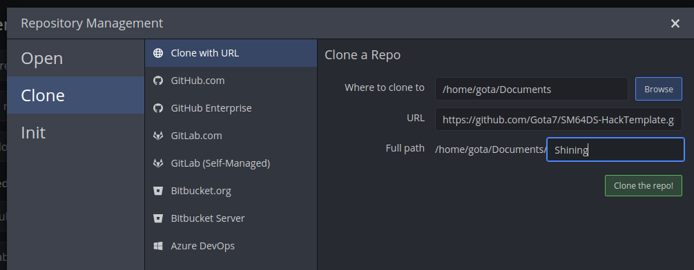

# Installation
You only need to follow these instructions once to install the template to your PC.

## Requirements
Here is what you will need to run everything in the template:

* [.NET 6](https://dotnet.microsoft.com/en-us/download/dotnet/6.0)
* [.NET Framework 4.7.2 Runtime](https://dotnet.microsoft.com/en-us/download/dotnet-framework/net472)
* [Python 3](https://www.python.org/downloads/) - Remember to check the box for adding it to PATH!
* A git client (such as [Gitkraken](https://www.gitkraken.com/download))

### Linux Additions
If you are using Linux, you will need to install all of the .NET stuff using `WINE`, but also install `.NET 6` natively. Additionally, `ninja` needs to be installed as well.

## Downloading
It is important to download the template through a git client so that version control can be utilized. While this is not necessary for the template to function, you will be happy that you have it set up this way :} The first step is to determine if you want your hack to be public or private. I will be using Gitkraken for this tutorial.

### Private Hacks
Private hacks will be stored locally to your computer. If you are using a client that is not Gitkraken, you may be able to push to private repositories on Github, but these instructions assume that this is not the case.

* First, hit the `Clone` button in Gitkraken in a new tab:

* Next, select `Clone With URL` and select a parent path without spaces in it.
* For the URL put `https://github.com/Gota7/SM64DS-HackTemplate.git`.
* Make sure your full path doesn't have spaces in it.
* Hit `Clone the repo!`

* Gitkraken will ask you if you want to open the repository now, hit `Open Now`.

### Publick Hacks
Public hacks are stored publicly on Github.

* Make a Github account and fork [the template repo](https://github.com/Gota7/SM64DS-HackTemplate).
* Sign into your Github account on Gitkraken.

* Then, hit the `Clone` button in Gitkraken in a new tab:

* Next, select `Github.com` and select a parent path without spaces in it.
* Select the forked repository you made in `Repository to clone`.
* Make sure your full path doesn't have spaces in it.
* Hit `Clone the repo!`

* Gitkraken will ask you if you want to open the repository now, hit `Open Now`.

## Install Tools
Now that the repository has been cloned, all that is left is to install the tools needed within the template. This can easily be done by double clicking `toolsInstall.bat` or running `python toolsInstall.py` on a command line. You can use this script to reinstall tools as needed. Ex: If SM64DSe Ultimate has an update, just re-rerun this script and enter `y` when prompted to reinstall it!

## Back Home
[Back](index.md)